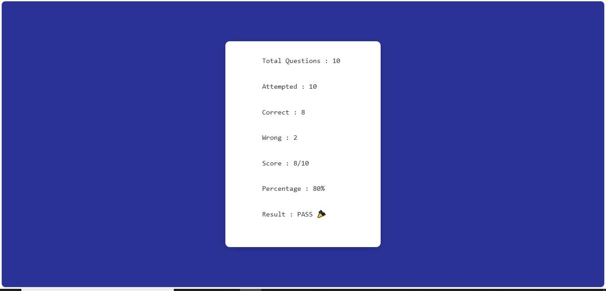
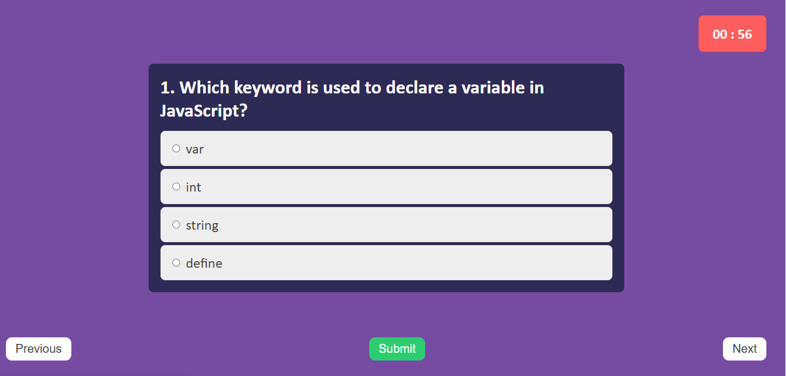

# 📝 Quiz Application

A modern and responsive **Quiz Application** built using **HTML5, CSS3, and JavaScript**. The application allows users to answer multiple-choice questions within a fixed time limit, navigate between questions, and receive a detailed performance summary after completing the quiz.

---

## 🎥 Project Demo

**Watch the Demo:**
https://drive.google.com/file/d/1TEu-4upC4Kcp5-EZrDoARydFzn3MOcwA/view?usp=sharing

---

## 📸 Screenshots

### 📝 Quiz Screen



---

### 📊 Result Screen



---

## ✨ Features

* ⏳ 60-second timer for each question
* 📝 Multiple Choice Questions (MCQs)
* ⬅️ Previous and ➡️ Next navigation
* ✅ Submit answers individually
* 📊 Detailed result summary

  * Total Questions
  * Attempted Questions
  * Correct Answers
  * Wrong Answers
  * Final Score
  * Percentage
  * Pass/Fail Status
* 🎨 Clean and responsive user interface
* ⚡ Fast and lightweight (Vanilla JavaScript)

---

## 🛠️ Built With

* HTML5
* CSS3
* JavaScript (ES6)

---

## 📁 Project Structure

```text
Quiz-App/
│
├── index.html
├── style.css
├── script.js
├── screenshot.png
└── README.md
```

---

## 🚀 Getting Started

### Clone the Repository

```bash
git clone https://github.com/bambhaniyadhara14/Quiz-App.git
```

### Open the Project

```bash
cd Quiz-App
```

Run the project by opening **index.html** in your browser or by using the **Live Server** extension in Visual Studio Code.

---

## 🎯 How It Works

1. Launch the application.
2. Read the question displayed on the screen.
3. Select the correct option.
4. Click **Submit** to save your answer.
5. Navigate using **Previous** and **Next** buttons.
6. Complete all questions before the timer expires.
7. View your final score and performance summary.

---

## 📊 Result Summary

```text
Total Questions      : 10
Attempted Questions  : 10
Correct Answers      : 8
Wrong Answers        : 2
Final Score          : 8 / 10
Percentage           : 80%
Result               : PASS 🎉
```

---

## 🧮 Result Calculation

```text
Correct Answers = Number of Correct Responses

Wrong Answers = Attempted Questions − Correct Answers

Percentage = (Correct Answers ÷ Total Questions) × 100

Pass  → Percentage ≥ 40%

Fail  → Percentage < 40%
```

---

## 📂 File Description

| File           | Description                                                                                           |
| -------------- | ----------------------------------------------------------------------------------------------------- |
| **index.html** | Defines the structure of the application                                                              |
| **style.css**  | Handles layout, styling, responsiveness, timer, buttons, and result card                              |
| **script.js**  | Implements quiz logic, timer, navigation, answer validation, score calculation, and result generation |

---

## 🚀 Future Improvements

* 💾 Save answers while navigating
* 🔀 Randomize questions
* 🔄 Shuffle answer options
* 🌙 Dark Mode
* 📱 Enhanced mobile responsiveness
* 💾 Store scores using Local Storage
* 🏆 Leaderboard
* 📚 Difficulty Levels (Easy, Medium, Hard)

---

## 👩‍💻 Author

**Dhara Bambhaniya**

GitHub: **https://github.com/bambhaniyadhara14**

---

## ⭐ If You Like This Project

If you found this project useful or interesting, consider giving it a **⭐ Star** on GitHub. Your support is greatly appreciated!
